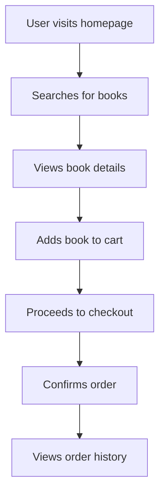
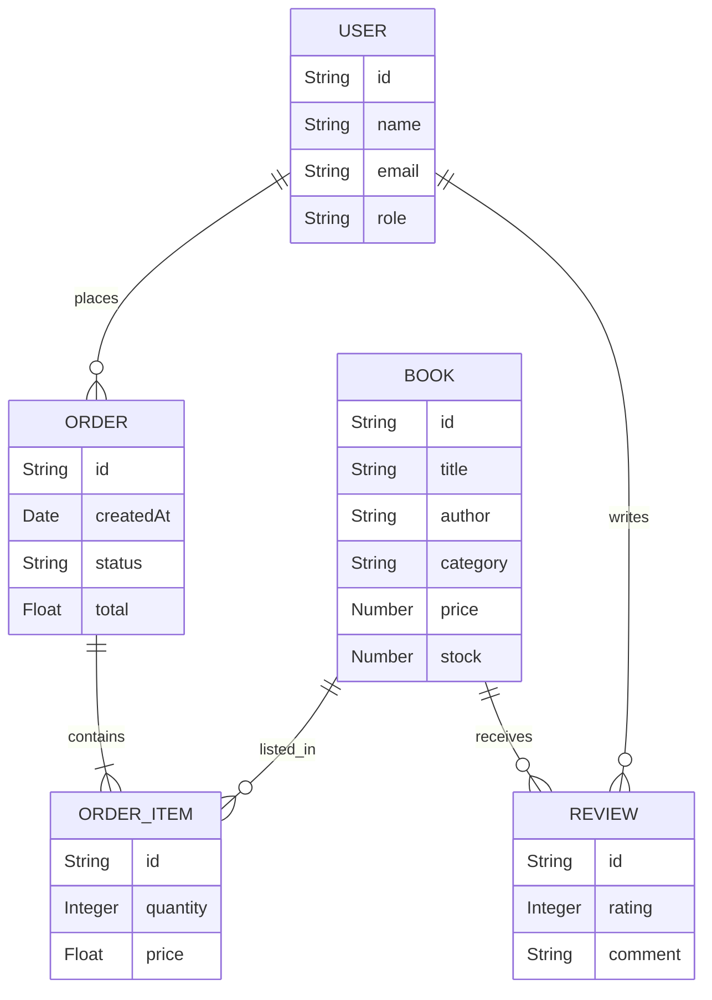

# BookStore


## Introduction

BookStore is a full-featured web application designed to facilitate the management and browsing of books. It provides a streamlined interface for users to search, purchase, and review books online. The platform supports user authentication, book categorization, and comprehensive order management, making it an ideal solution for online bookstores or personal book inventory systems.

## Features

- User registration and authentication system
- Browsing and searching for books by category, title, or author
- Add, edit, or delete book listings (admin only)
- Shopping cart and order processing
- User profiles and order history
- Book ratings and reviews
- RESTful API endpoints for easy integration
- Responsive user interface for desktop and mobile devices

## Requirements

To run BookStore, ensure you have the following prerequisites:

- Node.js (version 14 or higher)
- npm or yarn (package manager)
- MongoDB (for data storage)
- Git (to clone the repository)
- A modern web browser (for accessing the frontend)

Optional tools:

- Docker and Docker Compose (for containerized deployment)

## Installation

Follow these steps to set up BookStore on your local machine:

1. Clone the repository:
    ```bash
    git clone https://github.com/EmnaWalha99/BookStore.git
    cd BookStore
    ```

2. Install dependencies for the backend and frontend:
    ```bash
    cd backend
    npm install
    cd ../frontend
    npm install
    ```

3. Set up your environment variables:
    - Copy the example environment file and fill in the required details:
    ```bash
    cp backend/.env.example backend/.env
    ```
    - Edit `backend/.env` to configure database connection strings and application secrets.

4. Start the MongoDB server:
    ```bash
    mongod
    ```

5. Run the backend server:
    ```bash
    cd backend
    npm run dev
    ```

6. Run the frontend application:
    ```bash
    cd ../frontend
    npm start
    ```

7. Access the application at `http://localhost:3000`.

## Usage

Once the application is running:

- Register for a new user account or log in with existing credentials.
- Browse the catalog to discover books by genre, author, or search keywords.
- Add books to your shopping cart and proceed to checkout.
- View and manage your previous orders under your profile.
- Leave reviews and ratings for books you have purchased.
- If you are an administrator, access the admin dashboard to manage inventory and orders.

### Example User Flow



## Configuration

You can customize BookStore by modifying the configuration files and environment variables provided.

- **Backend environment variables:** Located in `backend/.env`
    - `MONGODB_URI`: MongoDB connection string
    - `JWT_SECRET`: Secret key for JWT authentication
    - `PORT`: Backend server port

- **Frontend configuration:** If needed, adjust API endpoint URLs in environment-specific files (e.g., `.env.development` in the frontend).

- **Admin user setup:** Create an admin user directly in the database or via a special registration endpoint as specified in the documentation.

### Database Schema Overview



### REST API Endpoints

BookStore exposes a comprehensive REST API for managing books, users, orders, and reviews.

#### Get All Books (GET /api/books)

##### List All Books Endpoint

```api
{
    "title": "List all books",
    "description": "Fetches a paginated list of all available books.",
    "method": "GET",
    "baseUrl": "http://localhost:5000",
    "endpoint": "/api/books",
    "headers": [],
    "queryParams": [
        {
            "key": "page",
            "value": "Page number for pagination",
            "required": false
        },
        {
            "key": "category",
            "value": "Filter by book category",
            "required": false
        }
    ],
    "pathParams": [],
    "bodyType": "none",
    "requestBody": "",
    "responses": {
        "200": {
            "description": "Success",
            "body": "{\n  \"books\": [\n    { \"id\": \"1\", \"title\": \"Book Title\", \"author\": \"Author Name\", \"category\": \"Fiction\", \"price\": 19.99 }\n  ],\n  \"pagination\": { \"page\": 1, \"totalPages\": 5 }\n}"
        }
    }
}
```

##### Get Book Details (GET /api/books/:id)

```api
{
    "title": "Get book details",
    "description": "Returns detailed information for a specific book.",
    "method": "GET",
    "baseUrl": "http://localhost:5000",
    "endpoint": "/api/books/id",
    "headers": [],
    "queryParams": [],
    "pathParams": [
        {
            "key": "id",
            "value": "Book ID",
            "required": true
        }
    ],
    "bodyType": "none",
    "requestBody": "",
    "responses": {
        "200": {
            "description": "Success",
            "body": "{\n  \"id\": \"1\",\n  \"title\": \"Book Title\",\n  \"author\": \"Author Name\",\n  \"category\": \"Fiction\",\n  \"price\": 19.99,\n  \"reviews\": [ ... ]\n}"
        },
        "404": {
            "description": "Not Found",
            "body": "{\n  \"error\": \"Book not found\"\n}"
        }
    }
}
```

##### Create Order (POST /api/orders)

```api
{
    "title": "Create order",
    "description": "Places a new order for the authenticated user.",
    "method": "POST",
    "baseUrl": "http://localhost:5000",
    "endpoint": "/api/orders",
    "headers": [
        {
            "key": "Authorization",
            "value": "Bearer <JWT>",
            "required": true
        }
    ],
    "queryParams": [],
    "pathParams": [],
    "bodyType": "json",
    "requestBody": "{\n  \"orderItems\": [\n    { \"bookId\": \"1\", \"quantity\": 2 }\n  ]\n}",
    "responses": {
        "201": {
            "description": "Created",
            "body": "{\n  \"order\": {\n    \"id\": \"101\",\n    \"status\": \"pending\",\n    \"total\": 39.98\n  }\n}"
        },
        "400": {
            "description": "Bad Request",
            "body": "{\n  \"error\": \"Invalid order data\"\n}"
        }
    }
}
```

##### Add Book Review (POST /api/books/:id/reviews)

```api
{
    "title": "Add book review",
    "description": "Allows an authenticated user to add a review to a specific book.",
    "method": "POST",
    "baseUrl": "http://localhost:5000",
    "endpoint": "/api/books/id/reviews",
    "headers": [
        {
            "key": "Authorization",
            "value": "Bearer <JWT>",
            "required": true
        }
    ],
    "queryParams": [],
    "pathParams": [
        {
            "key": "id",
            "value": "Book ID",
            "required": true
        }
    ],
    "bodyType": "json",
    "requestBody": "{\n  \"rating\": 5,\n  \"comment\": \"A fantastic read!\"\n}",
    "responses": {
        "201": {
            "description": "Created",
            "body": "{\n  \"review\": {\n    \"id\": \"2001\",\n    \"rating\": 5,\n    \"comment\": \"A fantastic read!\"\n  }\n}"
        },
        "401": {
            "description": "Unauthorized",
            "body": "{\n  \"error\": \"Authentication required\"\n}"
        }
    }
}
```
Author: Emna WALHA
